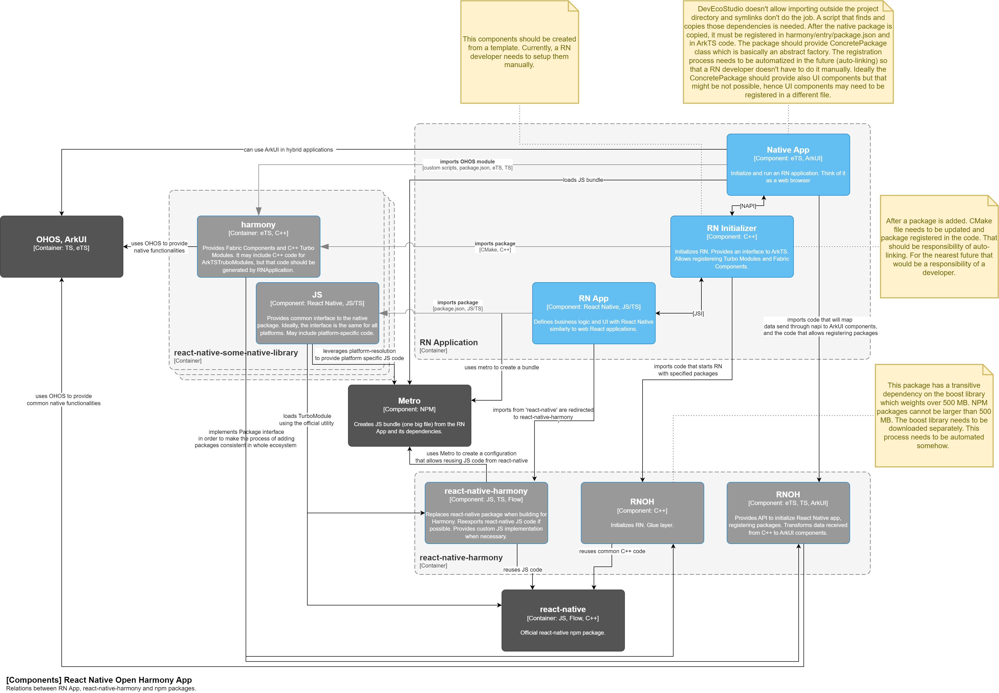

# React Native Open Harmony

## How to add `harmony` platform to your React Native project

1. Follow the instructions in the [Prerequisites](#prerequisites) section
1. Copy `tester/.npmrc` to your project
1. Create access token and set `RNOH_NPM_TOKEN` by following instructions above
1. Install react-native-harmony: `npm i react-native-harmony@npm:@rnoh/react-native-harmony`
1. Copy `metro.config.js` to your project
1. Create a new Harmony project in `<YOUR_PROJECT>/harmony`
1. Copy `tester/harmony/entry` module to `<YOUR_PROJECT>/harmony/entry`
1. Run `./node_modules/.bin/react-native unpack-harmony` - it make take a while
1. Add `"postinstall": "react-native unpack-harmony"` to `package.json`'s script section
1. Update `tester/harmony/entry/src/main/ets/pages/Index.ets`
   1. Unregister `SampleView` and `SamplePackage`
   1. Update "app_name" to match the name specified in `<YOUR_PROJECT>/app.json::name`
1. Update `tester/harmony/entry/src/main/cpp/CMakeLists.txt`
   1. Update `RNOH_CPP_DIR` - `set(RNOH_CPP_DIR "${CMAKE_CURRENT_SOURCE_DIR}/../../../../../node_modules/react-native-harmony/harmony/cpp")`
   1. Unregister `SamplePackage`
1. Create `jsbundle.h` by running `./node_modules/.bin/react-native bundle-harmony`
1. Open `harmony` project in DevEcoStudio and run the project

## Architecture



Note: native code lives in the `/tester/harmony/rnoh` directory (native code must be in the project directory).

## Current exports

### Components

- [ ] AccesibilityInfo
- [x] ActivityIndicator
- [x] Button\*
- [x] FlatList
- [x] Image
- [x] ImageBackground
- [ ] InputAccessoryView
- [x] KeyboardAvoidingView
- [ ] Modal
- [x] Pressable
- [x] RefreshControl
- [ ] SafeAreaView
- [x] ScrollView
- [x] SectionList
- [x] StatusBar
- [x] Switch
- [x] Text\*
- [x] TextInput\*
- [x] Touchable
- [x] TouchableHighlight
- [x] TouchableNativeFeedback (Android) - exported but not tested
- [x] TouchableOpacity
- [x] TouchableWithoutFeedback - handlers are not called
- [x] View
- [x] VirtualizedList
- [ ] VirtualizedSectionList

* Text measuring is not implemented. Width and height must be provided.

### Apis

- [x] Alert
- [x] Animated
- [x] Appearance
- [x] AppRegistry
- [x] AppState
- [x] BackHandler (stub)
- [x] DeviceInfo
- [ ] DevSettings
- [x] Dimensions
- [x] Easing
- [x] findNodeHandle
- [x] I18nManager
- [x] InteractionManager
- [x] Keyboard
- [x] LayoutAnimation (stub)
- [x] Linking (stub)
- [ ] LogBox
- [x] NativeEventEmitter
- [ ] Networking
- [x] PanResponder
- [x] PixelRatio
- [ ] Settings
- [ ] Share
- [x] StyleSheet
- [ ] Systrace
- [x] TurboModuleRegistry
- [x] UIManager
- [ ] unstable_batchedUpdates
- [x] useAnimatedValue
- [ ] useColorScheme
- [x] useWindowDimensions
- [ ] UTFSequence
- [ ] Vibration
- [ ] YellowBox

### Plugins

- [x] DeviceEventEmitter
- [ ] NativeAppEventEmitter
- [x] NativeModules
- [x] Platform
- [ ] PlatformColor
- [x] processColor
- [ ] requireNativeComponent
- [ ] RootTagContext

## Prerequisites

### DevEco Studio setup

Currently we use DevEco Studio 4.0.3.400. Follow steps below to install the IDE and required SDKs.

#### IDE Installation from official release

1. Open [a website with DevEco Studio releases](https://developer.harmonyos.com/cn/develop/deveco-studio/archive/)
1. Find the DevEco Studio 3.1 Release download link for your operating system and download the IDE
   _(we recommend using a computer with Windows OS because the Local Emulator is not supported in the MacOS version of the IDE)_
1. Unzip the downloaded compressed folder and double click the `deveco-Studio-3.1.0.200.exe` executable to open the installer
1. Go through the setup and wait for the installation to complete

#### SDK setup

Before starting the development you have to install required SDKs.

##### Additional setup (only for developers outside of China)

If your system language isn't Chinese and region code is different than CN, you will have to do some additional setup:

1. Close the DevEco Studio IDE
1. Open the `C:\Users\<username>\AppData\Roaming\Huawei\DevEcoStudio3.1\options\country.region.xml` file in your text editor
1. Change the `name` value of `countryregion` to `CN`. After making a change, the `country.region.xml` should have the following content:
   ```xml
   <application>
       <component name="CountryRegionSetting">
           <countryregion name="CN"/>
       </component>
   </application>
   ```
1. Save the file
1. Open the DevEco Studio. You will be able to install SDKs now.

##### Installing required SDKs

Warning: This project may use unreleased SDK, if buildProfile.template.json5 specifies SDK version higher than available publicly. In that case refer to section [Installing unreleased SDK](#installing-unreleased-sdk)

After doing a fresh install of the IDE you will see the SDK setup window just after opening the IDE.
Install the required SDK and proceed through the setup.

You will have to install some additional SDKs:

1. Go to `Settings` -> `SDKs`
1. Open the `HarmonyOS` tab (it should be opened by default)
1. Select the checkbox near the first item in the list (with the appropriate DevEco Studio version)
1. Press `Apply` button to begin installation and press `Ok` in the confirmation modal
1. Press the `Finish` button to finish installation and close the settings window

##### Installing unreleased SDK

1. Download SDK from internal channel or download unreleased DevEcoStudio (unreleased SDK should be included)
1. Change path to SDK in Dev Eco Studio: `Tools` -> `SDK Manager`
1. Update your `buildProfile.json5` based on `buildProfile.template.json5`
1. Update `hvigor`
   1. Copy contents of `plugins` from internal DevEcoStudio release directory to `tester/harmony/hvigor`
   1. Open `tester/harmony/hvigor/hvigor-config.json5` in DevEcoStudio
   1. DevEcoStudio should show yellow pop ups which should allow you to install dependencies and sync the project
1. DevEcoStudio: `Build` -> `Clean Project`
1. Remove `.cxx` directory from `entry` module
1. Build and run the tester app
1. On Mac, gatekeeper may complain about running unsigned apps. In such case disable gatekeeper completely or
   1. Press the Cancel button
   1. Open Mac Settings and search for Gatekeeper
   1. Click the button that allows running the cancelled application
   1. Try building the app again, this time you should be able to click `Open` button instead of `Move to bin`
   1. Repeat this process until Gatekeeper stops complaining (~20 apps/libs)

### Git setup

Before you begin, you have to install the git client on your computer. Refer to [the git documentation](https://git-scm.com/book/en/v2/Getting-Started-Installing-Git) for more details about installation.

In order to download project dependencies from the git repository, you will have to create the access token and save it in environment variables:

#### Creating the access token on GitLab

1. Press the `Edit profile` button on GitLab (press on your avatar on the navbar and then on the button)
1. Select `Access Tokens` tab in the menu on the left side
1. Fill the `Token name` field (e.g. it can be `rnoh`) and select the `api` scope in the `Select scopes` form
1. Press the `Create personal access token` button to create the token
1. Copy the token

#### Saving the access token in environment variables

1. Press `Win + R` to open the Windows Run prompt
1. Type in `sysdm.cpl` and click `Ok`
1. Go to the `Advanced` tab
1. Press on the `Environment Variables` button
1. Add the new user variable by pressing the `New` button under the User variables section
1. Set variable name to `RNOH_NPM_TOKEN` and paste your access token in the variable value field

More details about GitLab access tokens can be found [in the docs](https://docs.gitlab.com/ee/user/profile/personal_access_tokens.html)

### Cloning the repository

1. On the [project repository](https://gl.swmansion.com/rnoh/react-native-harmony) page press the clone button and copy the url to clone the project
1. In your terminal go to the directory where you want to store project files
1. Run the `git clone --recurse-submodules <url>` command to clone the repository with all submodules (replace the `<url>` with the copied url from the repository page on GitLab)

## Running `tester` app

### Dependencies installation

1. Go to the `react-native-harmony` directory
1. Create the package by running the `npm pack` command
1. Go to the `../tester` directory
1. Run the `npm i` command to install dependencies and setup build-profile
1. Open the `/tester/harmony/entry/oh_package.json5` in the DevEco Studio
1. Click "Sync" on the pop-up at the top

### Creating the Local Emulator (up to 3.1.0 DevEco Studio version only)

Before you start the project, you have to setup the device on which you will be able to run the application. Up to 3.1.0 version of the DevEco Studio IDE, you can create the Local Emulator to test the app on your computer.

1. Open the `Device Manager` (press the dropdown near the run button (green triangle) on the top ribbon)
1. Press on the `Device Manger` option on the list
1. Press the `Install` button to install the emulator SDK
1. Click on the `Finish` button after installation
1. Press the `New emulator` button in the bottom right corner
1. Go through the emulator setup. You can customize the emulator settings
1. You will see the success message popup if the emulator is successfully created

### Running the project on the Local Emulator (up to 3.1.0 DevEco Studio version only)

1. Open the `Device Manager` and start the emulator
1. Press the `Run entry` button in the top ribbon to build the project and run on the emulator
1. Wait for the build to finish

### Running `tester` app using the Metro Bundler

1. Go to the `/tester`
1. Run `npm i`
1. Run `npm run dev`
1. Open `/tester/harmony` in DevEco Studio
1. Start the HarmonyOS emulator
1. Run `hdc rport tcp:8081 tcp:8081`
   If `hdc` is not in your `PATH`, it can be found under `%USERPROFILE%/AppData/Local/Huawei/Sdk/hmscore/3.1.0/toolchains`
1. Start metro by running `npm run start`
1. Build and run entry module

### Benchmarking FPS

Frame times can be measured using `node ./scripts/get-frame-times`. It runs hdc hitrace and returns an array (frame times) which contains the time gap between repaints. You can also use it to get the frame times from manually captured traces.

You can use `node ./scripts/create-fps-stats` to get a performance report based on the measured frame times. `node ./scripts/create-fps-stats-flipper file1.csv file2.csv` generates the performance report based on one or more .csv files exported from flippers [rnperfmonitor](https://github.com/bamlab/react-native-flipper-performance-monitor) plugin, allowing to compare performance to react-native-android.

## Creating NPM Package

1. Go to the `/react-native-harmony`
1. Run `npm run pack:prod`
