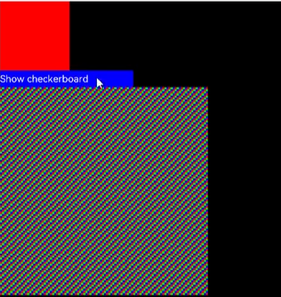

# Performance <!-- omit in toc -->

There is no single metric that can fully capture react-native-harmony performance. Therefore, in this report, we have devised a series of benchmarks to assess the performance of react-native-harmony against ArkUI and react-native-android. Our analysis reveals that, in general, react-native-harmony is slower compared than ArkUI and react-native-android. Improvements are possible in areas where react-native-harmony demonstrates a noticeable lower performance when compared to both ArkUI and react-native-android.

- [Rendering a large number of components](#rendering-a-large-number-of-components)
  - [Conclusions](#conclusions)
  - [Details](#details)
- [Animations](#animations)
  - [Conclusions](#conclusions-1)
  - [Observations](#observations)
  - [Details](#details-1)
- [Startup time](#startup-time)
  - [Conclusions](#conclusions-2)
  - [Details](#details-2)
- [UI Interaction](#ui-interaction)
  - [Conclusions](#conclusions-3)
  - [Details](#details-3)
- [Text rendering](#text-rendering)
  - [Conclusions](#conclusions-4)
  - [Details](#details-4)
- [Image rendering](#image-rendering)
  - [Conclusions](#conclusions-5)
  - [Details](#details-5)
    - [Scenario 1 - several small images in a grid like layout.](#scenario-1---several-small-images-in-a-grid-like-layout)
    - [Scenario 2 - fewer big images in a column.](#scenario-2---fewer-big-images-in-a-column)
- [ScrollView vs FlatList](#scrollview-vs-flatlist)
  - [Conclusions](#conclusions-6)
- [Details](#details-6)
- [Memory usage](#memory-usage)
  - [Conclusions](#conclusions-7)
  - [Details](#details-7)
    - [Scenario 1 - empty application](#scenario-1---empty-application)
    - [Scenario 2 - view with 100 components](#scenario-2---view-with-100-components)
- [Relation Between Component Creation and Stutters](#relation-between-component-creation-and-stutters)
  - [Conclusions](#conclusions-8)
  - [Details](#details-8)

## Rendering a large number of components

This benchmark represents an unusual situation, but represents generic rendering performance.

### Conclusions

**react-native-harmony is ~2 times slower than react-native-android and ~6 times slower than ArkUI. These values are more or less what was expected.**

### Details

Rendering ~10,000 tiny views.

- Commit https://gl.swmansion.com/rnoh/react-native-harmony/-/commit/fb3c847070e866075d0c662d2adad587d681a506
- Environment: emulator - HarmonyOS System-image-phone 3.1.0.306 Release, AMD Ryzen 5900X, 32 GB RAM
- Measurement method: recording analysis
- Measured times 5 times for each platform

|                          | ArkUI                                                                                                   | react-native-harmony                                                                                              | react-native-android                                                                                              |
| ------------------------ | ------------------------------------------------------------------------------------------------------- | ----------------------------------------------------------------------------------------------------------------- | ----------------------------------------------------------------------------------------------------------------- |
| Link to video            | [arkui-checkerboard.mp4](https://gl.swmansion.com/rnoh/file-storage/-/blob/main/arkui-checkerboard.mp4) | [rn-harmony-checkerboard.mp4](https://gl.swmansion.com/rnoh/file-storage/-/blob/main/rn-harmony-10000-fb3c84.mp4) | [rn-android-checkerboard.mp4](https://gl.swmansion.com/rnoh/file-storage/-/blob/main/rn-android-checkerboard.mp4) |
| Mean time [ms]           | 1588                                                                                                    | 9488                                                                                                              | 4307.5                                                                                                            |
| Standard Deviation* [ms] | 70                                                                                                      | 842                                                                                                               | 51                                                                                                                |

## Animations

Animations, although they are not essential from the functional perspective, they enhance UX and are used in almost every application.

### Conclusions

**Animations performance is not good enough. When native driver is not used, the performance is similar both on react-native-harmony and react-native-android. The native driver has potential to significantly improve the animation's performance on react-native-harmony although its implementation might be tricky.**

### Observations

- ArkUI example demonstrates better framerate when rendering 5000 elements than react-native-harmony when rendering 500 elements.
- react-native-harmony and react-native-android when react-native-android (without the native driver) have similar framerate when rendering 500 elements.
- The native driver significantly improves animation performance for react-native-android.
- The impact of the native driver grows with the number of elements.
- Number of elements impacts the performance of animating nonlayoutable properties (like opacity) similarly on react-native-harmony and react-native-android.

### Details

- Commit https://gl.swmansion.com/rnoh/react-native-harmony/-/commit/4f2315dcac3b82931f6bf1f2d14f6e76a07bbe84
- Environment: emulator HarmonyOS System-image-phone 3.1.0.306 Release, AMD Ryzen 5900X, 32 GB RAM

|               | ArkUI                                                                                            | react-native-harmony                                                                                      | react-native-android                                                                                      |
| ------------- | ------------------------------------------------------------------------------------------------ | --------------------------------------------------------------------------------------------------------- | --------------------------------------------------------------------------------------------------------- |
| Link to video | [arkui.mp4](https://gl.swmansion.com/rnoh/file-storage/-/blob/main/rn-harmony-native-4f2315.mp4) | [rn-harmony.mp4](https://gl.swmansion.com/rnoh/file-storage/-/blob/main/rn-harmony-animations-4f2315.mp4) | [rn-android.mp4](https://gl.swmansion.com/rnoh/file-storage/-/blob/main/rn-android-animations-4f2315.mp4) |

## Startup time

Startup time gives the first impression to the user. Users may assume that if the startup is slow, the app may struggle with other aspects as well.

### Conclusions

**react-native-harmony's startup time is ~4 times slower than ArkUI and ~5 times slower than react-native-android. There is a room for improvement on the react-native-harmony side e.g. currently, react-native-harmony tries to download a JS bundle from the metro server and fallbacks to included JS bundle.**

### Details

- Commit https://gl.swmansion.com/rnoh/react-native-harmony/-/commit/beb980274c5110e9144f16e09050646c5e691c2b
- Environment: emulator - HarmonyOS System-image-phone 3.1.0.306 Release, AMD Ryzen 5900X, 32 GB RAM
- Measurement method: recording analysis
- Average of 5 measurements.
- Application complexity: low ("hello world" example)

|                         | ArkUI | react-native-harmony | react-native-android |
| ----------------------- | ----- | -------------------- | -------------------- |
| Mean [ms]               | 734   | 2984                 | 556                  |
| Standard Deviation [ms] | 77    | 80                   | 22                   |

## UI Interaction

In this test, a simple component with a text inside was dragged on the screen.

### Conclusions

**react-native-harmony is slower than ArkUI and react-native-android by 4-5 FPS. This frame drop requires further investigation to be explained. react-native-android feels smoother than ArkUI.**

### Details

- Environment: emulator - HarmonyOS System-image-phone 3.1.0.306 Release, AMD Ryzen 5900X, 32 GB RAM
- Measurement method: ArkUI and rn-harmony: custom script that analyzes hdc output; Android: perf monitor
- Application complexity: minimal
- ArkUI emits touch event 60 times per second
- Component was dragged with `adb shell input swipe`

|                          | ArkUI | react-native-harmony | react-native-android |
| ------------------------ | ----- | -------------------- | -------------------- |
| Mean [FPS]               | 59,58 | 55,04                | 60                   |
| Standard Deviation [FPS] | 0.7   | 3                    | 0                    |
| Sample size              | 5     | 5                    | 1                    |

## Text rendering

This benchmark's intention was to test rendering of large amounts of Text views in a Scroll/Scrollview. This can give us an idea about the performance of rendering text.

### Conclusions

**The rendering of text is slightly slower on ArkUI than on react-native-android. react-native-harmony is noticeably slower than ArkUI. We suspect sending scroll events from ArkUI to React may have the impact on performance but this must be yet confirmed.**

### Details

- Commit: https://gl.swmansion.com/rnoh/react-native-harmony/-/commit/8bb8b4f41ecad9db2c274f0fc470fb83dff2f5d4
- Environment: emulator - HarmonyOS System-image-phone 3.1.0.306 Release, AMD Ryzen 6850U, 16 GB RAM
- Measurement method: analysis fom output of Flipper - RN Perf Monitor on Android, and hitrace on Harmony
- Application complexity: low (scrollview with n text components)
- Average of 5 measurements.

|                                     | ArkUI | react-native-harmony | react-native-android |
| ----------------------------------- | ----- | -------------------- | -------------------- |
| Mean - 1000 comp. [FPS]             | 58.2  | 51.7                 | 59.5                 |
| 95th percentile - 1000 comp. [FPS]  | 56.0  | 52.1                 | 60.0                 |
| Standard Dev. - 1000 comp. [FPS]    | 1.9   | 2.4                  | 0.3                  |
| Mean - 10000 comp. [FPS]            | 24.2  | 10.3                 | 33.5                 |
| 95th percentile - 10000 comp. [FPS] | 21.4  | 10.4                 | 34.0                 |
| Standard Dev. - 10000 comp. [FPS]   | 1.3   | 0.4                  | 1.6                  |

## Image rendering

Images are an important part of mobile apps. They can be a potential source of low performance.

### Conclusions

**Image rendering performance is strongly affected by the level of interpolation used. Decreasing the level of interpolation used by react-native-harmony should improve performance (high is currently used). ArkUI's performance seems to be more affected by high amounts of components than react-native-android. This might cause a small decrease in performance in complicated views.**

### Details

- Commit: https://gl.swmansion.com/rnoh/react-native-harmony/-/commit/aa5642c82af1897ce55481dd62041bb9f20a67ce
- Environment: emulator - HarmonyOS System-image-phone 3.1.0.306 Release, AMD Ryzen 6850U, 16 GB RAM
- Measurement method: analysis fom output of Flipper - RN Perf Monitor on Android, and hitrace on Harmony. Average of 5 samples.
- Application complexity: low (scrollview with n images)

#### Scenario 1 - several small images in a grid like layout.

|                                  | ArkUI | ArkUI H.I.\* | react-native-harmony | react-native-android |
| -------------------------------- | ----- | ------------ | -------------------- | -------------------- |
| Mean - 300 comp. [FPS]           | 59.9  | 50.1         | 49.1                 | 59.8                 |
| Standard Dev. - 300 comp. [FPS]  | 4.3   | 12.2         | 10.9                 | 0.4                  |
| Mean - 2400 comp. [FPS]          | 45.7  | 38.9         | 33.8                 | 59.7                 |
| Standard Dev. - 2400 comp. [FPS] | 13.3  | 14.9         | 13.78                | 0.8                  |
| Mean - 9600 comp. [FPS]          | 28.2  | 19.9         | 9.5                  | 39.4                 |
| Standard Dev. - 9600 comp. [FPS] | 8.3   | 5.8          | 1.62                 | 3.3                  |

\* Image interpolation set to high (default: none)

#### Scenario 2 - fewer big images in a column.

|                                  | ArkUI | ArkUI H.I.\* | react-native-harmony | react-native-android |
| -------------------------------- | ----- | ------------ | -------------------- | -------------------- |
| Mean - 300 comp. [FPS]           | 56.7  | 52.7         | 52.4                 | 59.4                 |
| Standard Dev. - 300 comp. [FPS]  | 7.1   | 8.5          | 9.4                  | 1.5                  |
| Mean - 2400 comp. [FPS]          | 52.4  | 49.1         | 30.3                 | 59.9                 |
| Standard Dev. - 2400 comp. [FPS] | 11.2  | 12.5         | 11.6                 | 0.3                  |
| Mean - 9600 comp. [FPS]          | 27.12 | 24.9         | 10.7                 | 49.4                 |
| Standard Dev. - 9600 comp. [FPS] | 8.92  | 10.4         | 1.7                  | 4.3                  |

\* Image interpolation set to high (default: none)

## ScrollView vs FlatList

ScrollView renders all elements at once. FlatList renders only elements dynamically once a user scrolls the list.

### Conclusions

FlatList on react-native-harmony has noticeable FPS drops when adding or removing elements to the list whereas react-native-android keeps solid 60 FPS. The main logic behind FlatList is the same for both platform. The native side receives only basic operations to perform like create, update or remove a component.

## Details

- Commit: https://gl.swmansion.com/rnoh/react-native-harmony/-/commit/b43bcdd41ce04aad746308cd04ec8ed144795867
- Environment: emulator - HarmonyOS System-image-phone 3.1.0.306 Release, AMD Ryzen 5900X, 32 GB RAM
- Measurement method: react-native-harmony - script that counts FPS based on hitrace output, performance
- Application: 100 rectangles with a text inside

|                            | react-native-harmony | react-native-android       |
| -------------------------- | -------------------- | -------------------------- |
| Mean                       | 57.9 FPS             | 60 FPS (no frames dropped) |
| Standard Deviation         | 6.3 FPS              | 0 FPS                      |
| 95th frame time percentile | 30.1 FPS             | 60 FPS                     |
| 99th frame time percentile | 20.2 FPS             | 60 FPS                     |

## Memory usage

Problems with memory usage can impact application performance. Less memory usage also improves the user experience on lower end devices.

### Conclusions

**The memory usage of react-native-harmony and react-native-android seems similar. Both react-native implementations use much more memory than ArkUI. react-native-harmony has known memory leaks, but they shouldn't have a big impact on performance, unless the application is kept alive for a long time. The difference between rn-android and rn-harmony is probably caused by measuring in different environments.**

### Details

- Commit: https://gl.swmansion.com/rnoh/react-native-harmony/-/commit/919764e0d1b169ac17e5de65bc1d19bf99f9e33a
- Environment: ArkUI and RNOH - Huawei Mate 40 Pro OpenHarmony-4.0.5.5, Android - Samsung Galaxy S22 SM-S901B/DS
- Measurement method: analysis of DevEco Studio Profiler, and Android Studio Profiler
- Application complexity: low (empty view for scenario 1, view with 100 components for scenario 2 )
- Average of 5 measurements.

#### Scenario 1 - empty application

|                         | ArkUI | react-native-harmony | react-native-android |
| ----------------------- | ----- | -------------------- | -------------------- |
| Mean Average [MB]       | 7     | 108                  | 164                  |
| Standard Deviation [MB] | 0     | 9                    | 5                    |

#### Scenario 2 - view with 100 components

|                                     | ArkUI | react-native-harmony | react-native-android |
| ----------------------------------- | ----- | -------------------- | -------------------- |
| Mean Average1 [MB]       | 8     | 118                  | 153                  |
| Standard Deviation1 [MB] | 0     | 3                    | 3                    |
| Mean Average2 [MB]       | 9     | 135                  | 184                  |
| Standard Deviation2 [MB] | 0     | 6                    | 5                    |

[1] - measurement after initial render  
[2] - measurement after hiding and showing components 10 times

## Relation Between Component Creation and Stutters

FlatList, a common React Native component, sends create, update and delete operations to the native side during scrolling. A stutter can be observed, when such operations are dispatched. The purpose of this benchmark is identifying where the problem lies. For that purpose, a mini-app was created that consist of a ScrollView on the first half on the screen and a space below where various number of components are created and removed every second. 

### Conclusions

ArkUI > react-native-android > react-native-harmony

Stutters are noticeably larger on react-native-harmony than on ArkUI. Stutters are similar, when ArkUI renders 5000 components and react-native-harmony 500. react-native-android doesn't seem to suffer from stuttering when rendering 500 components. When rendering 5000 components, RN Android suffered from bigger stutters than pure ArkUI and it took a couple of seconds for RN Android to update the UI despite specyfing that it should happend every second. No metrics were gathered, because measuring stuttering is difficult/unreliable with current tools. Further testing with a setup on ArkUI similar to the one used by react-native-harmony is needed.

### Details
- Commit: https://gl.swmansion.com/rnoh/react-native-harmony/-/commit/71befcb02caa1b73c9b802d740ac11c59ab3c73b
- Assessment method: Manual comparison
- Environment: Emulators and real devices
