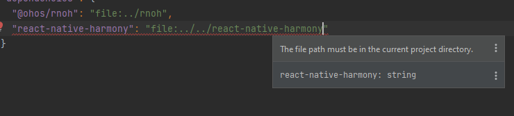
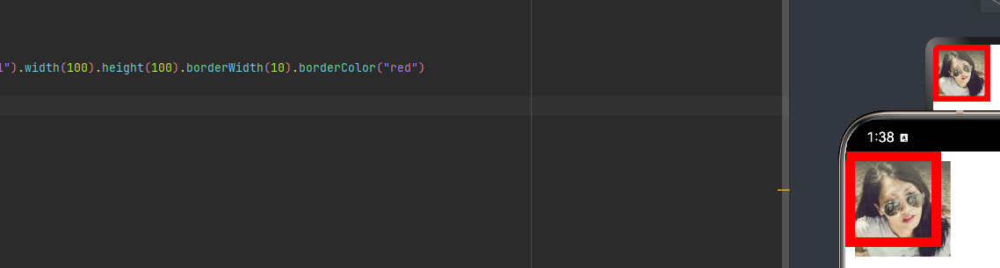
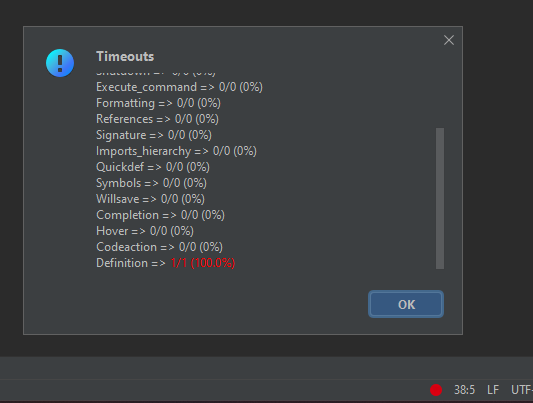

# Platform Problems and Limitations

## Limitations
### Text Measurement
OHOS needs to allow measuring text. It looks like [@ohos.measure.d.ts](https://gitee.com/openharmony/interface_sdk-js/blob/master/api/@ohos.measure.d.ts#L147) will do the job but we need to wait for v10. It's going to be used by  `TextLayoutManager.h`.

### DevEco Studio Project

It's not possible to use local npm packages located outside project directory. Symlinks don't do the trick. Harmony project root can't be `react-native-project` because of `package.json` conflicts (and that would break consistency). We may need to copy packages from node_modules to harmony project as a temporary solution.

```
.
└── react-native-project/
    ├── android
    ├── ios
    ├── harmony/
    │   ├── package.json
    │   └── entry/
    │       └── package.json    # can't import ../../node_modules/react-native-harmony
    ├── node_modules/
    │   ├── react-native-harmony/
    │   │   └── harmony/
    │   │       └── package.json
    │   └── react-native-some-native-package/
    │       ├── android
    │       ├── ios
    │       └── harmony/
    │           └── package.json
    ├── src    
    └── package.json
```


### Border Styling Issue
Border is misalignment when running app in the emulator. It works as expected in the previewer.



### napi_add_finalizer
We need to delete the callback function when it's no longer needed. It looks like this napi function is not supported. (IMO not supported napi functions shouldn't be in header files.)

## Problems

### DevEco Studio Language Servers
Language Servers are unstable at least in this project. eTS is particularly painful, because it's not supported by VS Code. To use ArkUI effectively, I need to switch to a new project, write the code there and paste it to this project.



### Border Styling API Consistency
Properties `borderWidth`, `borderColor` etc. don't support specifying values per edge, however property `border` allows that. 

### Global @Styles
Global `@Styles` can't be parametrized. We want to reuse `RNView.ets` props and keep components in separate files. Some way of mapping an object to properties would be useful.

```ts
@Styles function globalFancy () { // can't pass args here
  .width(120)
  .height(120)
  .backgroundColor(Color.Green)
}

@Styles function globalFancy (data: ViewData) {
  .width(data["width"])
  .height(data["height"])
  .backgroundColor(data["backgroundColor"])
}
```

### OHOS API types
TypeScript types could be provided as a npm package. That would allow other IDE/text editors like VS Code to automatically pick up types and improve suggestions.